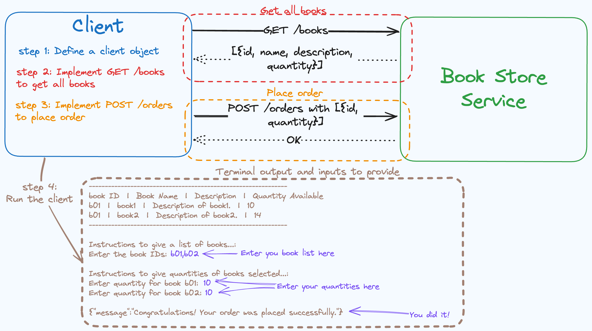

# Steps to Complete the Exercise



## Run the bookstore service
1. Open a terminal inside a preferred location.
2. Clone this repository on to that location by running `git clone https://github.com/ShammiL/bookstore.git`. Optionally, you could download the project as a ZIP as well.
3. In the same terminal, navigate into the bookstore_service project root with `cd bookstore_service`.
4. Run the command `bal run` to have the bookstore service up an running.
5. Make sure the service is running with no errors before sending requests. The service would be running correctly if you get the following terminal output after executing `bal run`.
```
Compiling source
        shammi/bookstore_service:0.1.0

Running executable

```
6. Once the service is running, the endpoints will be available at `http://localhost:9090`.

## Complete the exercise
1. Follow these steps to complete the exercise.
2. Complete the code in `main.bal` file inside the `bookstore_exercise` project. Follow the instructions provided under tasks 1, 2, and 3 inside the file.
3. Upon arriving at task 4, follow the instructions provided under task 4 to get the program running.

4. If all tasks have been correctly completed,
- A table containing details of all available books will be displayed on the console in the following structure.

        book ID  |  Book Name  |  Description  |  Quantity Available
- Below the table, you will find a prompt asking to provide a list of books you would like to order with instructions on how to provide the list.
- Provide the list of **bookIds** separated by commas. eg: `b01,b03,b04`
- Next, you will be asked to provide the quantity needed from each book you selected in the previous step. Instructions will also be provided on how to do this.
    - Note: Make sure the quantites you provide are less than the available quantities.
- If you have properly placed your order, you will receive a message "Congratulations! Your order was placed successfully.". This marks the successful completion of the exercise.
